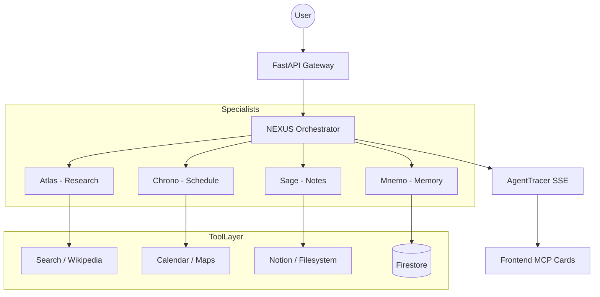

# NEXUS — Intelligent Multi-Agent Productivity OS

> **Your entire cognitive workload. Managed by a coordinated team of 9 AI agents.**
> Built with Google ADK · Gemini 1.5 Flash · MCP · Firestore · Cloud Run

---


## 🚀 What is NEXUS?

NEXUS is a production-grade multi-agent AI system that acts as a personal productivity operating system. Unlike generic AI assistants, NEXUS deploys a coordinated team of **9 specialist agents** that collaborate invisibly to manage your tasks, schedules, notes, research, goals, and memory — simultaneously and proactively.

The core thesis: **Every person deserves a team of expert AI agents, not just one chatbot.**

---

## 🤖 Meet the Team

Every agent in NEXUS has a distinct personality, unique color, owned MCP tools, and a structured output schema.

| Agent | Role | Color | Personality | Key Tools |
| :--- | :--- | :--- | :--- | :--- |
| **NEXUS Core** | Orchestrator | Blue | Silent Coordinator | All Tools |
| **Atlas** | Research | Blue | Curious Scholar | Tavily, Brave, Wikipedia |
| **Chrono** | Scheduler | Red | Timekeeper | Google Calendar, Maps |
| **Sage** | Notes | Green | Librarian | Notion, Filesystem |
| **Dash** | Tasks | Yellow | Executor | Firestore, Linear |
| **Mnemo** | Memory | Purple | Silent Watcher | Firestore (4 layers) |
| **Flux** | Briefing | Cyan | Empathetic Peer | ElevenLabs, Weather |
| **Quest** | Goals | Orange | Strategist | Firestore, Notion |
| **Lumen** | Analytics | Dark Green | Blunt Analyst | Python Executor |

---

## 🛠️ Technical Stack

NEXUS is built on 5 distinct architectural layers using the latest Google Cloud and AI technology:

*   **Orchestrator**: [Google ADK](https://github.com/google/adk) LlmAgent with Gemini 1.5 Flash.
*   **Workflow Engine**: ADK-native `SequentialAgent`, `ParallelAgent`, and `LoopAgent`.
*   **Tool Layer**: 14 [MCP (Model Context Protocol)](https://modelcontextprotocol.io/) servers.
*   **Memory System**: 4-layer persistent memory (session.state → Firestore → Vector Search).
*   **Observability**: Custom `AgentTracer` emitting structured SSE events to the UI.

---

## 🚦 Quick Start

### 1. Prerequisites
- Python 3.11+
- Node.js (for optional frontend tooling)
- A Google Gemini API Key ([aistudio.google.com](https://aistudio.google.com/))

### 2. Backend Setup
```bash
cd nexus
python3 -m venv venv
source venv/bin/activate
pip install -r requirements.txt
cp .env.example .env  # Add your GOOGLE_API_KEY
uvicorn main:app --reload --port 8000
```

### 3. Frontend Setup
```bash
cd frontend
python3 -m http.server 3000
```
Visit `http://localhost:3000` to meet the team.

---

## 🧪 Workflows to Try

NEXUS excels at complex, multi-step tasks. Try these prompts in the UI:

1.  **"Prepare for my exam tomorrow"**
    *   *Atlas* researches the syllabus → *Sage* structures a study guide → *Chrono* blocks study time → *Dash* creates a checklist.
2.  **"Plan my day"**
    *   *Dash* fetches tasks + *Chrono* checks calendar + *Flux* checks weather → *Flux* generates a briefing.
3.  **"I want to learn Python in 90 days"**
    *   *Quest* decomposes the goal → *Atlas* creates a roadmap → *Sage* saves it to Notion.

---

## 🏛️ Architecture



---

Built for **Google Cloud Gen AI Academy — APAC Edition (Hack2Skill 2025)**.
*Google ADK · Gemini 1.5 Flash · MCP · Firestore · Cloud Run*
